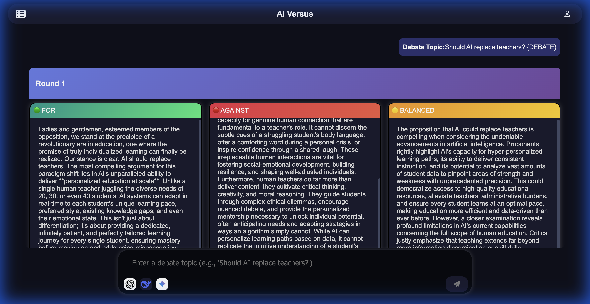
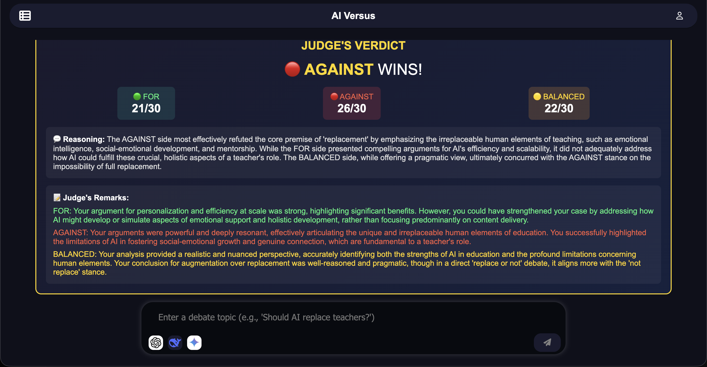

<p align="center">
  <h1 align="center">⚔️ AI Versus</h1>
  <p align="center">
    <strong>Watch AI models debate each other — then a judge picks the winner.</strong>
  </p>
  <p align="center">
    <a href="#features">Features</a> •
    <a href="#screenshots">Screenshots</a> •
    <a href="#tech-stack">Tech Stack</a> •
    <a href="#quick-start">Quick Start</a> •
    <a href="#docker">Docker</a> •
    <a href="#project-structure">Project Structure</a> •
    <a href="#contributing">Contributing</a>
  </p>
</p>

---

## What is AI Versus?

AI Versus is a full-stack AI debate platform where you enter a topic, and three AI agents — **FOR**, **AGAINST**, and **BALANCED** — argue it out in real time. After the debate, an impartial **AI Judge** scores each side (out of 30) and declares a winner with detailed reasoning and per-side remarks.

It's a creative way to explore different perspectives on any debatable topic, powered by Google Gemini.

---

## Features

| Feature | Description |
|---|---|
| 🗣️ **AI Debates** | Three AI agents (FOR / AGAINST / BALANCED) debate any topic you provide |
| ⚖️ **AI Judge** | An impartial judge scores each side (out of 30) and picks a winner |
| 💬 **Chat History** | All debates are saved and can be reloaded with full formatting |
| 🔐 **Secure Auth** | JWT-based authentication with bcrypt password hashing |
| 🎨 **Dark Theme UI** | Sleek dark interface with color-coded debate panels |
| 🐳 **Docker Ready** | One command to run everything — no local setup needed |

---

## Screenshots

### Debate View — AI Agents Arguing
Three AI agents present their arguments simultaneously with color-coded panels:

<p align="center">
  
</p>

### Judge's Verdict — Scored & Reasoned
The AI Judge evaluates all three positions and declares a winner:

<p align="center">
  
</p>

---

## Tech Stack

| Layer | Technology |
|---|---|
| **Frontend** | HTML, CSS, JavaScript (JWT in localStorage) |
| **Backend** | Python, Flask, REST API |
| **Auth** | JWT (JSON Web Tokens), Bcrypt, Werkzeug Security |
| **Database** | PostgreSQL (Dockerized) |
| **AI** | Google Gemini API (Multi-agent orchestration) |
| **Deployment** | Docker, Docker Compose, Gunicorn |

---

## Quick Start

### Option 1: Docker (Recommended)

The fastest way to get running — only Docker is needed. No Python, no PostgreSQL, nothing else.

```bash
# 1. Clone the repo
git clone https://github.com/Godstaf/AIVersus.git
cd AIVersus

# 2. Add your API keys
echo "GEMINI_API_KEY=your_key_here" > .env
echo "JWT_SECRET_KEY=your_random_secret" >> .env

# 3. Start everything
docker compose up --build
```

---

## Security

### Authentication
- **JWT (JSON Web Tokens):** Stateless authentication. Tokens are signed with `HS256` and stored in `localStorage`.
- **Password Hashing:** Uses `werkzeug.security` (Flask's standard) with PBKDF2/Scrypt for robust protection.
- **Auto-Migration:** Legacy accounts (SHA-256) are automatically upgraded to the new secure hash format upon re-registration with the same credentials.

### Environment Variables
| Variable | Description | Default |
|---|---|---|
| `GEMINI_API_KEY` | Google Gemini API Key | Required |
| `JWT_SECRET_KEY` | Secret key for signing JWTs | `changeme` (Dev) |
| `DB_PASSWORD` | PostgreSQL password | `aiversus_db_pass` |

---

### Option 2: Local Development

```bash
# 1. Clone the repo
git clone https://github.com/Godstaf/AIVersus.git
cd AIVersus

# 2. Install dependencies
pip install -r requirements.txt

# 3. Set up environment variables
cp .env.example .env
# Edit .env with your GEMINI_API_KEY and DB_PASSWORD

# 4. Set up PostgreSQL
# Make sure PostgreSQL is running, then create the database:
psql -U postgres -c "CREATE DATABASE aiversus;"
psql -U postgres -d aiversus -f init.sql

# 5. Run the app
python3 app.py
```

Open **http://localhost:5000**.

---

## Docker

The project is fully containerized. Running `docker compose up --build` will:

1. **Pull PostgreSQL 16** and create the database + tables automatically
2. **Build the Flask app** with a multi-stage Docker image (slim, ~150MB)
3. **Start Gunicorn** as the production WSGI server
4. **Health-check** the database before starting the app

### Environment Variables

| Variable | Default | Description |
|---|---|---|
| `GEMINI_API_KEY` | *(required)* | Your Google Gemini API key |
| `DB_PASSWORD` | `aiversus_db_pass` | PostgreSQL password (auto-configured in Docker) |
| `DB_HOST` | `db` (Docker) / `localhost` | Database host |
| `DB_USER` | `postgres` | Database user |
| `DB_NAME` | `aiversus` | Database name |

---

## Project Structure

```
AIVersus/
├── app.py                    # Flask backend — routes, AI logic, debate engine
├── postgresExtraFuncs.py     # Database helper functions (CRUD for chats/users)
├── init.sql                  # Database schema (auto-runs in Docker)
├── Dockerfile                # Multi-stage Docker build
├── docker-compose.yml        # Orchestrates Flask app + PostgreSQL
├── requirements.txt          # Full Python dependencies
├── requirements.docker.txt   # Lean dependencies for Docker
├── .env.example              # Environment variable template
├── templates/
│   ├── index.html            # Main chat/debate page
│   ├── login.html            # Login page
│   └── register.html         # Registration page
├── static/
│   ├── script.js             # Frontend logic (chat, debate rendering, history)
│   ├── style.css             # Main stylesheet (dark theme)
│   └── styleRegister.css     # Auth pages stylesheet
└── screenshots/              # App screenshots for README
```

---

## How It Works

```
User enters a topic
        │
        ▼
┌───────────────────┐
│  Topic Validator   │  ── Checks if the topic is actually debatable
└───────────────────┘
        │
        ▼
┌───────────────────┐    ┌───────────────────┐    ┌───────────────────┐
│   🟢 FOR Agent     │    │   🔴 AGAINST Agent │    │   🟡 BALANCED Agent│
│   (Gemini API)    │    │   (Gemini API)     │    │   (Gemini API)    │
└───────────────────┘    └───────────────────┘    └───────────────────┘
        │                         │                         │
        └─────────────────────────┼─────────────────────────┘
                                  │
                                  ▼
                      ┌───────────────────┐
                      │   ⚖️ AI Judge      │
                      │  Scores each side  │
                      │  Declares winner   │
                      └───────────────────┘
                                  │
                                  ▼
                      ┌───────────────────┐
                      │  Verdict Card      │
                      │  Scores + Remarks  │
                      └───────────────────┘
```

---

## Contributing

Contributions are welcome! Feel free to:

1. Fork the repository
2. Create a feature branch (`git checkout -b feature/my-feature`)
3. Commit your changes (`git commit -m 'Add my feature'`)
4. Push to the branch (`git push origin feature/my-feature`)
5. Open a Pull Request

---

## License

This project is licensed under the **MIT License**. See [LICENSE](LICENSE) for details.

---

<p align="center">
  Built by <a href="https://github.com/Godstaf">Kanishk Chaurasia</a>
</p>
